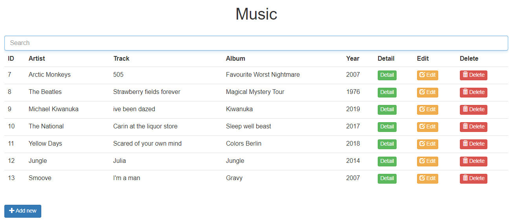
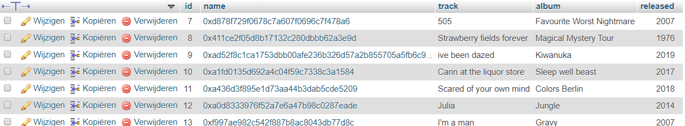
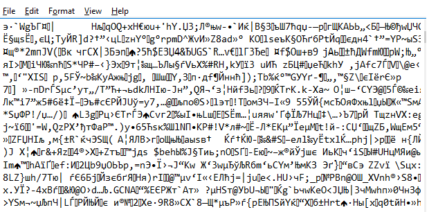
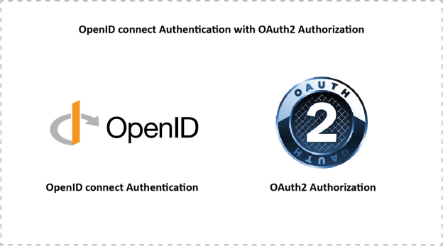

# MySQL Encryption
## field level encryption

 
Display the encrypted data readable and searchable. 
Encrypt your sensitive data when added to database. 

## TDE

 
lightweight option for an extra layer of safety. 

## Required
* PHP 5.0 or PHP 7  
* WAMPP,XAMPP,etc  

## includes:
 

- Prepared pdo connection  
- AES encryption through SQL  
- SSL encryption through PHP  
- Transparent Data (at rest) Encryption  
- Components to Create, Read, Update & Delete Encrypted Data for MySQL 5.7  
- Key Generator  
- Login with Hashing password  
- Login with Authentication

 
